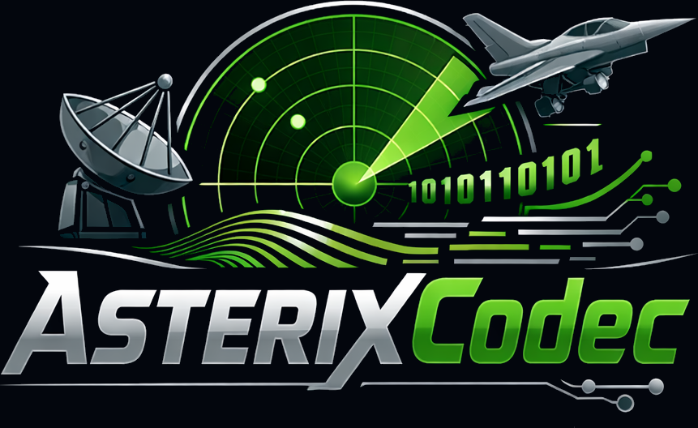

<div align="center">
  <picture>
    <source media="(prefers-color-scheme: light)" srcset=".github/images/logo.png">
    <source media="(prefers-color-scheme: dark)" srcset=".github/images/logo.png">
    
  </picture>
</div>

<div align="center">
  <h3>Comprehensive ASTERIX protocol toolkit for Air Traffic Management (ATM)</h3>
</div>


## CI Status

| Category | Tests |
|----------|-------|
| CAT001   | [](https://github.com/nathan-casabieille/ASTERIXCodec/actions/workflows/ci-cat01.yml) |
| CAT002   | [](https://github.com/nathan-casabieille/ASTERIXCodec/actions/workflows/ci-cat02.yml) |
| CAT034   | [](https://github.com/nathan-casabieille/ASTERIXCodec/actions/workflows/ci-cat34.yml) |

---

A high-performance, spec-driven C++20 library for encoding and decoding **ASTERIX** (All Purpose Structured EUROCONTROL Surveillance Information Exchange) messages.

The category structure is loaded at runtime from an XML file, making it straightforward to add new categories without recompiling the library.

---

## Features

- **XML-driven data dictionary** — category definitions (items, encodings, UAP) are parsed from `specs/CATXX.xml` via [pugixml](https://github.com/zeux/pugixml); no hardcoded category logic.
- **All standard item types** — Fixed (group), Extended (FX-bit chaining), Repetitive (FX-bit list), RepetitiveGroup (count-prefixed structured groups), Compound (PSF-driven optional sub-items), and Explicit/SP.
- **Dynamic UAP selection** — for CAT01 the plot/track variant is auto-detected from `I001/020 TYP` on a per-record basis.
- **Multi-record blocks** — a single Data Block can carry any number of Data Records; the decode loop handles them correctly.
- **Strict bounds checking** — `BitReader` and `BitWriter` throw on any out-of-bounds access; mandatory-item violations are flagged on the `DecodedRecord`.
- **Zero-copy decode** — hot paths use `std::span<const uint8_t>`; no intermediate buffer copies.
- **Pretty-printer** — physical values (NM, °, FL, kt) and table lookups are rendered in the test executable for visual inspection.

---

## Supported Categories

| Category | Description | Edition |
|----------|-------------|---------|
| CAT001   | Transmission of Monoradar Data Target Reports | 1.4 |
| CAT002   | Transmission of Monoradar Service Messages | 1.2 |
| CAT034   | Transmission of Monoradar Service Messages | 1.29 |

Support for additional categories can be added by dropping a new XML spec into `specs/` and calling `codec.registerCategory(loadSpec("specs/CATXX.xml"))`.

---

## Project Structure

```
ASTERIXCodec/
├── CMakeLists.txt                   # C++20 build; FetchContent(pugixml v1.14)
├── include/ASTERIXCodec/
│   ├── Types.hpp                    # Core metadata and decoded-value types
│   ├── BitStream.hpp                # MSB-first BitReader / BitWriter (header-only)
│   ├── SpecLoader.hpp               # loadSpec(path) → CategoryDef
│   └── Codec.hpp                    # Public API: decode() + encode()
├── src/
│   ├── SpecLoader.cpp               # pugixml → CategoryDef parser
│   └── Codec.cpp                    # FSPEC + item decode/encode engine
├── specs/
│   ├── CAT01_definition.txt         # Original EUROCONTROL source definition
│   ├── CAT01.xml                    # XML spec consumed by the library
│   ├── CAT02_definition.txt         # Original EUROCONTROL source definition
│   ├── CAT02.xml                    # XML spec consumed by the library
│   ├── CAT34_definition.txt         # Original EUROCONTROL source definition
│   └── CAT34.xml                    # XML spec consumed by the library
└── tests/
    ├── test_cat01.cpp               # 7 test cases, 87+ assertions
    ├── test_cat02.cpp               # 7 test cases covering all CAT02 item types
    └── test_cat34.cpp               # 10 test cases covering all CAT34 item types incl. Compound
```

---

## Requirements

| Tool | Minimum version |
|------|----------------|
| C++ compiler | GCC 12 / Clang 15 / MSVC 19.34 (C++20 required) |
| CMake | 3.20 |
| Internet access | Required once to fetch pugixml via CMake FetchContent |

---

## Build

```bash
# Configure (Debug)
cmake -B build -DCMAKE_BUILD_TYPE=Debug

# Build library + test executable
cmake --build build -j$(nproc)

# Run tests
./build/test_cat01
./build/test_cat02
./build/test_cat34

# Optionally override the spec file path
./build/test_cat01 /path/to/specs/CAT01.xml
./build/test_cat02 /path/to/specs/CAT02.xml
./build/test_cat34 /path/to/specs/CAT34.xml
```

Expected output ends with `ALL TESTS PASSED`.

---

## Quick API Example

```cpp
#include "ASTERIXCodec/Codec.hpp"
#include "ASTERIXCodec/SpecLoader.hpp"

using namespace asterix;

// 1. Load category definition from XML
Codec codec;
codec.registerCategory(loadSpec("specs/CAT01.xml"));

// 2. Decode a raw frame received from the network
std::vector<uint8_t> raw = { /* ... */ };
DecodedBlock block = codec.decode(raw);

if (!block.valid) {
    std::cerr << "Error: " << block.error << '\n';
}

for (const auto& rec : block.records) {
    // Access I001/010 Data Source Identifier
    uint64_t sac = rec.items.at("010").fields.at("SAC");
    uint64_t sic = rec.items.at("010").fields.at("SIC");

    // Access I001/040 polar position (raw values — apply scale manually)
    // RHO [NM] = raw / 128.0
    // THETA [°] = raw * 360.0 / 65536.0
    uint64_t rho_raw   = rec.items.at("040").fields.at("RHO");
    uint64_t theta_raw = rec.items.at("040").fields.at("THETA");

    // Check UAP variant
    bool is_track = (rec.uap_variation == "track");
}

// 3. Encode a record back to bytes
DecodedRecord rec;
rec.uap_variation = "track";
// ... populate rec.items ...
std::vector<uint8_t> frame = codec.encode(1, { rec });
```

---

## ASTERIX Wire Format (CAT01 reminder)

```
Data Block
  ├── CAT   [1 byte]   Category number (0x01)
  ├── LEN   [2 bytes]  Total block length in bytes (big-endian)
  └── Data Records (one or more)
        ├── FSPEC  [1–N bytes]  Presence bitmask; each byte: [I7|I6|I5|I4|I3|I2|I1|FX]
        │                        FX=1 → next FSPEC byte follows; FX=0 → last byte
        └── Items  [variable]   Present items in UAP order
```

**Item encoding types:**

| Type | Description |
|------|-------------|
| Fixed | Fixed-length; sub-elements bit-packed MSB-first |
| Extended | Variable octets; each = 7 data bits + 1 FX bit |
| Repetitive | FX-terminated list; each octet = 7-bit value + FX |
| RepetitiveGroup | 1-byte count prefix; then N × structured sub-element group |
| Compound | PSF indicator byte(s) select optional named sub-items (each a Fixed group) |
| Explicit (SP/RE) | First byte = total length (inclusive); raw payload follows |

**CAT01 UAP selection** — `I001/020` field `TYP` acts as a discriminator: `TYP=0` selects the **plot** UAP, `TYP=1` selects the **track** UAP. Because both UAPs share the same first two FSPEC slots (I010, I020), a single decode pass is sufficient.

---

## XML Spec Schema

The `specs/CAT01.xml` file follows this structure:

```xml
<Category cat="1" name="..." edition="1.4" date="2022-08-18">

  <DataItems>
    <!-- Fixed item -->
    <DataItem id="010" name="Data Source Identifier" presence="mandatory">
      <Fixed>
        <Element name="SAC" bits="8" encoding="raw"/>
        <Element name="SIC" bits="8" encoding="raw"/>
      </Fixed>
    </DataItem>

    <!-- Extended item (variable octets, each = 7 bits + FX) -->
    <DataItem id="020" name="Target Report Descriptor">
      <Extended>
        <Octet>   <!-- must sum to exactly 7 bits -->
          <Element name="TYP" bits="1" encoding="table">
            <Entry value="0" meaning="Plot"/>
            <Entry value="1" meaning="Track"/>
          </Element>
          <!-- ... -->
        </Octet>
      </Extended>
    </DataItem>

    <!-- Repetitive FX item -->
    <DataItem id="030" name="Warning/Error Conditions">
      <Repetitive type="fx">
        <Element bits="7" encoding="table"> <!-- ... --> </Element>
      </Repetitive>
    </DataItem>

    <!-- Repetitive count-prefixed structured group (e.g. CAT002/070) -->
    <DataItem id="070" name="Plot Count Values">
      <Repetitive type="count" count_bytes="1">
        <Group>
          <Element name="A"       bits="1"  encoding="table"/>
          <Element name="IDENT"   bits="5"  encoding="table"/>
          <Element name="COUNTER" bits="10" encoding="raw"/>
        </Group>
      </Repetitive>
    </DataItem>

    <!-- Compound item (e.g. CAT034/050 System Configuration and Status)        -->
    <!-- PSF byte: bit7=sub-item 0, …, bit1=sub-item 6, bit0=FX continuation  -->
    <!-- Only present sub-items follow the PSF byte(s) on the wire.            -->
    <DataItem id="050" name="System Configuration and Status">
      <Compound>
        <SubItem name="COM">           <!-- slot 0: PSF bit7 -->
          <Fixed>
            <Element name="NOGO" bits="1" encoding="table">
              <Entry value="0" meaning="System is released for operational use"/>
              <Entry value="1" meaning="Operational use of System is inhibited"/>
            </Element>
            <!-- … -->
            <Spare bits="1"/>
          </Fixed>
        </SubItem>
        <SubItem name="-"/>            <!-- slot 1: PSF bit6 – unused -->
        <SubItem name="-"/>            <!-- slot 2: PSF bit5 – unused -->
        <SubItem name="PSR">           <!-- slot 3: PSF bit4 -->
          <Fixed> <!-- … --> </Fixed>
        </SubItem>
        <!-- … -->
      </Compound>
    </DataItem>

    <!-- Special Purpose Field -->
    <DataItem id="SP" name="Special Purpose Field">
      <Explicit type="sp"/>
    </DataItem>
  </DataItems>

  <UAPs default="plot">
    <Variation name="plot">
      <Item ref="010"/> <Item ref="020"/> <!-- ... -->
    </Variation>
    <Variation name="track">
      <Item ref="010"/> <Item ref="020"/> <Item ref="161"/> <!-- ... -->
    </Variation>
    <!-- UAP discriminator -->
    <Case item="020" field="TYP">
      <When value="0" use="plot"/>
      <When value="1" use="track"/>
    </Case>
  </UAPs>

</Category>
```

**Supported `encoding` values:** `raw`, `table`, `unsigned_quantity`, `signed_quantity`, `string_octal`.

Decoded Compound sub-fields are accessed via `item.compound_sub_fields["COM"]["NOGO"]`.

---

## References

- [EUROCONTROL ASTERIX website](https://www.eurocontrol.int/asterix)
